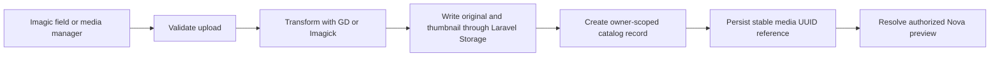

<div align="center">
  <h1>Imagic 2.0</h1>
  <p><strong>A production-minded image field and personal media library for Laravel Nova.</strong></p>
  <p>Crop. Transform. Organize. Reuse. Store anywhere Laravel can.</p>
  <p>
    <a href="https://github.com/ayvazyan10/nova-imagic/actions/workflows/ci.yml"></a>
    <a href="https://www.php.net/"></a>
    <a href="https://laravel.com/"></a>
    <a href="https://nova.laravel.com/"></a>
    <a href="license.md"></a>
    <a href="https://packagist.org/packages/ayvazyan10/nova-imagic"></a>
  </p>
  <p>
    <a href="#quick-start">Quick start</a> ·
    <a href="#media-library">Media library</a> ·
    <a href="#field-recipes">Field recipes</a> ·
    <a href="#configuration">Configuration</a> ·
    <a href="UPGRADE.md">Upgrade guide</a>
  </p>
</div>

---

Imagic turns a Nova image field into a complete image workflow. Users can upload
one image or a sortable gallery, crop before upload, run predictable server-side
transformations, and reuse their own uploads from an integrated media library.
The backend writes through Laravel's filesystem abstraction, so local, S3, and
S3-compatible disks share the same path-safe storage flow.

> [!IMPORTANT]
> These are the Imagic 2.x docs. The Composer constraints retain PHP 8.1 and
> Laravel 9–11 only for EOL migration compatibility; the security-maintained
> baseline is PHP 8.2+, Laravel 12, Nova 5, and Intervention Image 3. Version 2
> also introduces private-by-default storage, owner-scoped media references,
> migrations, and the media manager. Read [UPGRADE.md](UPGRADE.md) before
> upgrading from 1.x.

## What ships in 2.0

| | Capability | What it gives you |
| --- | --- | --- |
| 🖼️ | **Nova image field** | Single or sortable multiple images across form, detail, and index views |
| ✂️ | **Visual editing** | Responsive crop-before-upload with optional aspect-ratio and output dimensions |
| ✨ | **Server transforms** | Orientation, fit, widen, watermark, centered or positioned crop, resize, quality, and format conversion |
| ☁️ | **Storage portability** | Laravel disks, including remote S3/S3-compatible storage, without requiring local filesystem paths |
| 🗂️ | **Personal media library** | Per-user uploads, nested folders, search, filters, sorting, pagination, reuse, rename, move, and guarded deletion |
| 🛡️ | **Safer uploads** | MIME, extension, byte-size, dimensions, pixel-count, and batch limits before persistence |
| 🔒 | **Stable ownership** | Opaque object names, private defaults, owner-scoped routes, stable `media:<uuid>` values, and batch rollback |

## Quick start

Nova uses a private Composer repository. Configure your licensed Nova Composer
credentials, then install Imagic and run its auto-loaded migrations:

```bash
composer require ayvazyan10/nova-imagic:^2.0
php artisan migrate
```

Add the field to a Nova resource:

```php
use Ayvazyan10\Imagic\Imagic;
use Laravel\Nova\Http\Requests\NovaRequest;

public function fields(NovaRequest $request): array
{
    return [
        Imagic::make('Gallery', 'images')
            ->multiple()
            ->mediaLibrary()
            ->maxFiles(12)
            ->maxFileSize(8 * 1024 * 1024) // Bytes
            ->liveCrop(aspectRatio: 4 / 3)
            ->fit(1600, 1200)
            ->quality(88)
            ->directory('products'),
    ];
}
```

For a multiple field, use a `json`, `text`, or `longText` database column. The
field understands Laravel `array`, `json`, `object`, and `collection` casts and
avoids double encoding.

The service provider, compiled Nova assets, media routes, migrations, and media
library navigation entry are discovered automatically.

### Optional publishing

Publish configuration only when the application needs different defaults:

```bash
php artisan vendor:publish --tag=imagic-config
```

Migrations are auto-loaded while the media library is enabled. Publish them only
when your deployment process requires application-owned migration files:

```bash
php artisan vendor:publish --tag=imagic-migrations
php artisan migrate
```

For an intentionally public local disk, create Laravel's storage link if the
application does not already have one:

```bash
php artisan storage:link
```

## Media library

The media library is not a generic server file browser. It is an authenticated,
image-only catalog of uploads owned by the current Nova user.

It appears as **Media Library** in Nova's navigation and normally opens at
`/nova/imagic-media`. Its vendor API normally lives at
`/nova-vendor/imagic`; both paths are configurable.

### The workflow



### What users can do

- Upload one image or a validated batch.
- Create nested folders and rename or delete empty folders.
- Search by filename and filter by supported image type.
- Sort by name, size, or date and switch between grid and list views.
- Reuse library images from fields that enable `mediaLibrary()`.
- Reorder multiple values by drag-and-drop or keyboard controls.
- Rename or move catalog entries without changing immutable storage keys.
- Copy an authenticated Nova content URL.
- Permanently delete one or many selected items after confirmation.

Each query, preview, stream, update, move, and deletion is scoped to the current
Nova user. An optional application gate can restrict the library further.

> [!CAUTION]
> Deleting managed media removes its original and thumbnail. Imagic cannot know
> about every arbitrary model attribute that may reference that item, so it does
> not rewrite those attributes. Confirm shared references before deletion.

## Field recipes

### A single transformed image

```php
Imagic::make('Cover', 'cover_image')
    ->fit(1200, 630)
    ->quality(85)
    ->convert();
```

### A sortable, reusable gallery

```php
Imagic::make('Gallery', 'gallery')
    ->multiple()
    ->maxFiles(20)
    ->mediaLibrary()
    ->liveCrop()
    ->widen(2000);
```

### A centered server crop

```php
Imagic::make('Avatar', 'avatar')
    ->crop(600, 600);       // Omitted coordinates center the crop
```

To crop from the top-left instead, pass explicit coordinates:

```php
Imagic::make('Avatar', 'avatar')
    ->crop(600, 600, 0, 0);
```

### Watermark on S3

```php
Imagic::make('Artwork', 'artwork')
    ->disk('s3')
    ->directory('artwork')
    ->watermark(
        storage_path('app/watermarks/brand.png'),
        'bottom-right',
        16,
        16,
    )
    ->quality(90);
```

The watermark source is a trusted local path configured by application code.
Never pass request input to `watermark()` or `directory()`.

### A deliberate public URL instead of a catalog reference

Cataloged values resolve through authenticated Nova routes even if the storage
object is public. When a field must persist a public disk URL for use outside
Nova, opt out explicitly:

```php
Imagic::make('Public Image', 'public_image')
    ->mediaLibrary(false)
    ->disk('public')
    ->visibility('public')
    ->directory('site-images');
```

Use this mode only with a disk and data that are intentionally public.

## Image pipeline

Configured server operations run in a fixed order:

1. EXIF orientation when available
2. fit
3. widen
4. watermark
5. crop
6. resize
7. encode

Fluent call order does not change this pipeline. Fit, widen, and resize avoid
upscaling. Interactive cropping happens in the browser before this server-side
pipeline. Animated GIFs are not offered for client-side cropping.

Imagic accepts JPEG, PNG, GIF, and WebP by default. SVG is deliberately excluded
because it may contain active content.

## Field API

| Method | Purpose |
| --- | --- |
| `multiple(bool $enabled = true)` | Enable sortable multiple values |
| `mediaLibrary(bool $enabled = true)` | Show the picker and catalog direct uploads |
| `liveCrop(bool $enabled = true, ?float $aspectRatio = null)` | Enable interactive crop-before-upload |
| `cropAspectRatio(?float $ratio)` | Set or clear the interactive crop ratio |
| `maxFiles(int $maximum)` | Limit total items in a multiple field |
| `maxFileSize(int $bytes)` | Limit each direct field upload in bytes |
| `disk(string $disk)` | Override the configured Laravel disk |
| `directory(string $path)` | Override the safe relative storage directory |
| `visibility('private'\|'public')` | Override filesystem visibility for the field |
| `crop(?int $width, ?int $height, ?int $left, ?int $top)` | Crop on the server; omitted coordinates center the crop |
| `fit(?int $width, ?int $height)` | Cover the requested bounds without upscaling |
| `resize(?int $width, ?int $height)` | Resize while preserving aspect ratio |
| `widen(?int $width)` | Resize proportionally by width |
| `quality(int $quality)` | Set output quality from 0 to 100 |
| `convert(bool $enabled = true)` | Convert to WebP, or preserve a supported source format |
| `driver('gd'\|'imagick')` | Select the image-processing driver |
| `watermark(string $path, string $position = 'bottom-right', int $x = 0, int $y = 0)` | Overlay a trusted local watermark |

`disk()` and `directory()` may be combined. Directories must be relative, must
not start or end with `/`, and may not contain dot or backslash path segments.

## Stored values and compatibility

Managed uploads persist as stable references instead of storage paths:

```text
media:550e8400-e29b-41d4-a716-446655440000
```

A multiple field stores a JSON array of those references. During Nova
serialization, Imagic expands references owned by the current user into the
authorized preview metadata required by the UI. Private disk paths are not
exposed in API responses, and a reference owned by another user is rejected on
save.

Existing 1.x scalar URLs/paths, JSON arrays, and comma-separated input remain
readable. Legacy files are not moved or automatically imported into the new
catalog.

## Authorization

Nova authentication and authorization middleware protect both the manager and
vendor API. To add an application-specific rule, define a gate:

```php
use Illuminate\Support\Facades\Gate;

Gate::define('manage-imagic-media', function ($user): bool {
    return $user->is_admin;
});
```

Then publish the config and set:

```php
'media_library' => [
    'authorization_gate' => 'manage-imagic-media',
    // ...
],
```

The gate controls the navigation entry, page, and API. `show_in_menu = false`
hides the menu item; it is not an authorization control.

## Configuration

The safe defaults live in `config/imagic.php`:

| Option | Default | Purpose |
| --- | --- | --- |
| `disk` | Nova disk or `public` | Disk for managed originals and thumbnails |
| `directory` | `imagic` | Base path within the disk |
| `visibility` | `private` | Default filesystem visibility |
| `field.visibility` | top-level `visibility` | Direct field-upload visibility |
| `field.media_library` | `true` | Catalog field uploads and show the picker |
| `field.live_crop` | `false` | Enable live crop for all fields by default |
| `field.crop_aspect_ratio` | `null` | Optional global crop ratio |
| `field.max_files` | `20` | Default total for a multiple field |
| `uploads.max_file_size` | `12288` | Maximum input size in KiB |
| `uploads.max_width` / `max_height` | `12000` | Maximum decoded dimensions |
| `uploads.max_pixels` | `40000000` | Pixel-count/decompression safety limit |
| `uploads.max_files` | `20` | Maximum manager batch size |
| `transform.driver` | `gd` | `gd` or `imagick` |
| `transform.format` | `webp` | Default manager output format |
| `transform.quality` | `88` | Default manager output quality |
| `thumbnail.width` / `height` | `480` / `320` | Media-manager thumbnail bounds |
| `media_library.enabled` | `true` | Enable catalog migrations, routes, and UI |
| `media_library.authorization_gate` | `null` | Optional application gate name |
| `media_library.per_page` | `24` | Default page size |
| `media_library.max_per_page` | `100` | Maximum API page size |
| `media_library.rate_limit` | `120` | Requests per user per minute |

Environment shortcuts cover the main storage and transformer settings:

```dotenv
IMAGIC_DISK=s3
IMAGIC_DIRECTORY=imagic
IMAGIC_VISIBILITY=private
# Optional; inherits IMAGIC_VISIBILITY when omitted
IMAGIC_FIELD_VISIBILITY=private
IMAGIC_DRIVER=imagick
IMAGIC_FORMAT=webp
```

> [!WARNING]
> Filesystem visibility cannot make a file private when the selected local disk
> is already exposed by the web server. In particular, a `public` disk behind
> `storage:link` is publicly reachable regardless of the catalog's authenticated
> proxy URL. Use a non-public local disk or a correctly private cloud bucket for
> sensitive uploads.

For S3 or another remote disk, configure endpoint, region, credentials, bucket,
and URL in the application's Laravel filesystem configuration. Imagic writes
bytes through Laravel Storage and never asks a remote disk for a local path.

## Compatibility and support

The Composer constraints remain broad enough to help existing applications move
to Imagic 2 without combining the package migration with every framework
upgrade. That install compatibility is not a promise that an EOL framework is
safe to operate.

| Status | PHP | Laravel | Nova | Intervention Image |
| --- | --- | --- | --- | --- |
| **Current security-maintained baseline** | **8.2+** | **12** | **5** | **3.11+** |
| EOL compatibility/migration only | 8.1 | 9 | 4 | 2.7 |
| EOL compatibility/migration only | 8.2 | 10 | 4 | 3.11+ |
| EOL compatibility/migration only | 8.3 | 11 | 5 | 3.11+ |

The CI matrix exercises the three legacy rows only to catch Imagic source
regressions. Intervention Image 2.7 and Laravel 9–11 are upstream end-of-life;
use the current baseline for production deployments. See Laravel's
[support policy](https://laravel.com/docs/12.x/releases#support-policy) for
framework maintenance dates.

> [!WARNING]
> Composer may refuse a fresh legacy resolution because active framework
> advisories have no patched release on those lines. Do not disable Composer
> security blocking in a production application to install Imagic. Upgrade the
> application stack; the CI-only legacy override exists solely to detect Imagic
> regressions.

Runtime requirements:

- Composer 2
- PHP `fileinfo` and `mbstring`
- GD or Imagick
- EXIF recommended for camera orientation
- A modern browser supported by the installed Nova version

Refer to Laravel's [Nova installation guide](https://nova.laravel.com/docs/v5/installation)
and Intervention Image's [installation guide](https://image.intervention.io/v3/getting-started/installation)
for their platform requirements.

## Security and operational notes

- Uploads are untrusted input. Keep conservative byte, dimension, pixel, and
  batch limits for the memory available to PHP.
- Catalog routes and URLs are for authenticated Nova use, regardless of the
  underlying object's filesystem visibility.
- A `private` visibility setting does not override a publicly mounted local
  storage directory; choose the disk and web-server mapping accordingly.
- Keep Laravel, Nova, Intervention Image, PHP, and the GD/Imagick system
  libraries patched.
- Never disable Composer advisory blocking to keep an EOL application stack in
  production; upgrade to the security-maintained baseline instead.
- Use least-privilege filesystem credentials and bucket policies.
- Do not expose Nova vendor routes without their configured authentication and
  authorization middleware.

Report vulnerabilities privately according to [SECURITY.md](SECURITY.md).

## Project guides

| Guide | Use it for |
| --- | --- |
| [Upgrade guide](UPGRADE.md) | Moving safely from Imagic 1.x to 2.x |
| [Changelog](CHANGELOG.md) | User-visible additions, fixes, and security changes |
| [Security policy](SECURITY.md) | Supported versions and private vulnerability reporting |
| [Contributing guide](contributing.md) | Local setup, tests, assets, and pull-request expectations |
| [Release process](RELEASING.md) | Licensed compatibility matrix and maintainer checklist |

## License

Imagic is open-source software released under the [MIT license](license.md).
It is maintained by [Razmik Ayvazyan](https://github.com/ayvazyan10).
